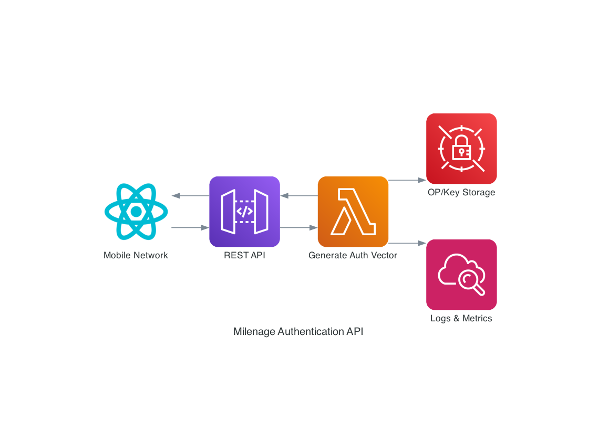

### **Technical Document for Task 4: Implementing 3GPP Milenage Authentication**  

## **Objective**
Build a Node.js REST API to generate 3G authentication vectors using AWS serverless.  

---

## **Index**
- [Objective](#objective)
- [Architecture Overview](#architecture-overview)
- [Class Definitions](#class-definitions)
- [Interfaces](#interfaces)
- [AWS Integration](#aws-integration)
- [Standards & Open Source](#standards--open-source)
- [Unit Tests](#unit-tests)
- [Running the Tests](#running-the-tests)

---

## **Architecture Overview**  
- **AWS Components:**  
  - **API Gateway** (REST) for endpoint exposure.  
  - **Lambda** (Node.js) for cryptographic processing.  
  - **Secrets Manager** for secure storage of OP/Secret Keys.

## Class Definitions
```javascript
class MilenageAlgorithm {
    constructor(op, secretKey) {
        this.op = op;
        this.secretKey = secretKey;
    }

    generateAV() {
        // Implement 3GPP 35.206 logic
        return { RAND, XRES, CK, IK, AUTN };
    }
}

class AuthAPI {
    async handleRequest(input) {
        const milenage = new MilenageAlgorithm(input.op, input.secretKey);
        return milenage.generateAV();
    }
}
```

## Interfaces
- **API Endpoint:**  
  ```bash
  POST /generate-av
  Body: { "op": "hex-string", "secretKey": "hex-string" }
  Response: { "RAND": "...", "XRES": "...", ... }
  ```

## AWS Integration
- **Lambda Function Code:**  
  ```javascript
  exports.handler = async (event) => {
      const { op, secretKey } = JSON.parse(event.body);
      const auth = new AuthAPI();
      return auth.handleRequest({ op, secretKey });
  };
  ```

  **CloudFormation Template Excerpt:**
  ```yaml
  MilenageAuthFunction:
    Type: AWS::Serverless::Function
    Properties:
      CodeUri: ../src/task4/
      Handler: auth_api.handler
      Runtime: nodejs14.x
      Timeout: 30
      Environment:
        Variables:
          SECRET_KEY_ARN: !Ref OPSecretKey
      Policies:
        - AWSSecretsManagerGetSecretValuePolicy:
            SecretArn: !Ref OPSecretKey
      Events:
        AuthVector:
          Type: Api
          Properties:
            Path: /generate-av
            Method: post

  OPSecretKey:
    Type: AWS::SecretsManager::Secret
    Properties:
      Name: milenage/op-secret-key
      Description: Secret keys for Milenage authentication algorithm
      SecretString: '{"op":"00000000000000000000000000000000","secretKey":"00000000000000000000000000000000"}'
  ```

## Standards & Open Source
- **3GPP TS 35.206:** Direct implementation of Milenage.
- **Node.js Crypto Module:** For AES and SHA-256 operations.
- **License Compliance:** MIT-licensed `crypto-js` for encoding.

## Diagram

### Milenage Authentication Architecture


### Milenage Algorithm Flow
Milenage algorithm:
1. Start with K (secret key) and OP
2. Generate random RAND
3. Apply AES-based operations (f1-f5)
4. Generate MAC (for AUTN)
5. Generate XRES, CK, IK
6. Assemble final authentication vector
7. Return to caller

### 3G Authentication Sequence
1. Mobile Device requesting access
2. Network sending authentication request to API
3. API generating authentication vector
4. Network challenging mobile device with RAND and AUTN
5. Mobile device computing response
6. Network verifying response against XRES
7. Successful authentication and key agreement

## Unit Tests
- **Test Case 1:** Validate output against 3GPP test vectors from TS 35.206.  
- **Test Case 2:** Ensure error handling for invalid key lengths.
- **Test Case 3:** Verify proper operation with keys retrieved from Secrets Manager.

## **Running the Tests**
To see the Milenage authentication API in action, follow these steps:

##### Prerequisites
```bash
# Install required Python dependencies
pip install diagrams

# Install required Node.js dependencies
cd src/task4
npm install jest crypto
```

##### Running the Visualizer
The visualizer demonstrates a complete authentication flow:

```bash
# From the project root directory
node src/task4/visualize_flow.js
```

This will output a step-by-step simulation showing:
- Authentication request processing
- OPc calculation
- Generation of authentication vectors (RAND, XRES, CK, IK, AUTN)
- Complete API response

##### Running Tests
Unit tests verify the Milenage implementation against 3GPP test vectors:

```bash
# From the project root directory
cd src/task4
npx jest tests/test_auth_api.js
```

##### Generating Architecture Diagrams
To generate the authentication sequence diagram:

```bash
# From the project root directory
python src/task4/diagrams/sequence_diagram.py
```

This will create a diagram file in the current directory showing the authentication process flow.
